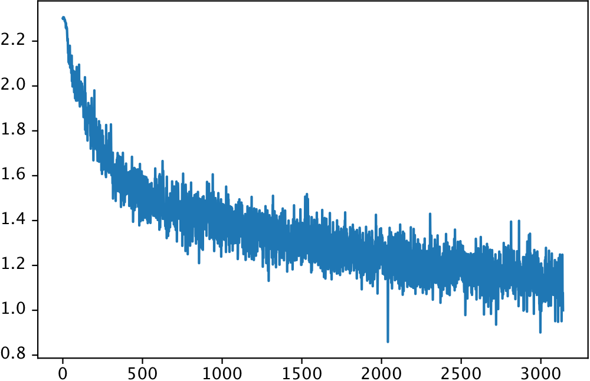
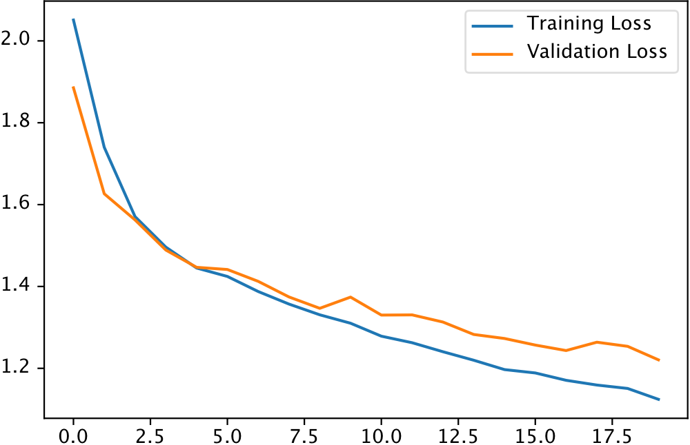

Training a Classifier
=====================

Training a classifier on images is one of the most prominent examples showcasing what a library can do. Inspired by PyTorch's tutorials, we want to train a convolutional neural network on the CIFAR10 dataset using the features of PyBlaze.

At first, we import all libraries that we're going to use throughout this example:

.. code-block:: python

    import torch.nn as nn
    import torch.nn.functional as F
    import torch.optim as optim
    import torchvision
    import torchvision.transforms as transforms
    import pyblaze.nn as xnn
    import pyblaze.nn.functional as X
    import matplotlib.pyplot as plt

Loading the Data
----------------

At the beginning, we load our data conveniently using `torchvision`. PyBlaze does not come into play yet.

.. code-block:: python

    train_val_dataset = torchvision.datasets.CIFAR10(
        root="~/Downloads/", train=True, download=True, transform=transforms.ToTensor()
    )
    test_dataset = torchvision.datasets.CIFAR10(
        root="~/Downloads/", train=False, download=True, transform=transforms.ToTensor()
    )

Initializing Data Loaders
^^^^^^^^^^^^^^^^^^^^^^^^^

First, we set aside 20% of all training data for validation. Usually, you would need to compute the sizes of the resulting subsets and then split the dataset randomly. However, using PyBlaze, you can do this more conveniently.

By simply importing `pyblaze.nn`, datasets receive an additional function `random_split`. This accepts arbitrarily many floating point numbers indicating the fraction of the dataset to be randomly sampled into subsets. Note that these numbers need to add to 1.

.. code-block:: python

    train_dataset, val_dataset = train_val_dataset.random_split(0.8, 0.2)

Finally, we can initialize the data loaders. Normally, you would initialize a data loader and pass the dataset to the initializer. However, this always feels odd. Hence, as soon as you import `pyblaze.nn`, we extend PyTorch's native dataset with a `loader` method. The method creates a data loader while its parameters are the same as for PyTorch's data loader initializer.

.. code-block:: python

    train_loader = train_dataset.loader(batch_size=256, num_workers=4, shuffle=True)
    val_loader = val_dataset.loader(batch_size=2048)
    test_loader = test_dataset.loader(batch_size=2048)

Note that we set the batch size for validation and testing significantly higher than for training: as we are running the model in eval mode, no gradients need to be stored and much less memory is required.

Defining the Model
------------------

As a model, we define a common convolutional neural network. Most importantly, **defining a model for PyBlaze is no different than defining a model natively in PyTorch**. However, PyBlaze provides additional functionality to make it easier working with models.

One feature that we are using here is the `Estimator` mixin. Conforming to this class adds three methods to the model: `fit`, `evaluate` and `predict`. While you may implement these methods yourself, the default implementation delegates the functionality of these methods to an **engine**. The engine class is the heart of PyBlaze, driving the training of models. You may define the engine class to use using the `__engine__` class variable.

.. code-block:: python

    class Model(xnn.Estimator, nn.Module):
    
        __engine__ = xnn.SupervisedEngine
        
        def __init__(self):
            super().__init__()
            self.conv1 = nn.Conv2d(3, 6, 5)
            self.pool = nn.MaxPool2d(2, 2)
            self.conv2 = nn.Conv2d(6, 16, 5)
            self.fc1 = nn.Linear(400, 120)
            self.fc2 = nn.Linear(120, 84)
            self.fc3 = nn.Linear(84, 10)

        def forward(self, x):
            x = self.pool(F.relu(self.conv1(x)))
            x = self.pool(F.relu(self.conv2(x)))
            x = x.view(-1, 400)
            x = F.relu(self.fc1(x))
            x = F.relu(self.fc2(x))
            x = self.fc3(x)
            return x

Note that using the `Estimator` mixin is no requirement. You may also initialize the engine explicitly while passing the model and then call `train` or related methods on the engine. This has the same effect. However, defining a default engine to use is useful in cases where the model is used in many different places in a program and always requires the same engine.

Likewise, it is a useful feature for developing libraries: when defining a model, an engine can be used to decouple training code from the model definition. Setting a default engine can then bind the training code to the model and hide the complexity of initializing an extra engine from the end user.

Initializing a model is as simple as for pure PyTorch modules. In case the model has some configuration parameters and you want to save the model's architecture along with its weights to a file, consider using the `xnn.Configurable` mixin (see the class documentation).

.. code-block:: python

    model = Model()

Training the Model
------------------

Model training and evaluation is the core feature of PyBlaze. The following code trains the model as follows:

* By calling `fit` on the model itself, we use the model's default engine and call its `train` method with the provided parameters.
* We train with the data from `train_loader` and evaluate the performance after every epoch with data from `val_loader`.
* We train for 20 epochs (max) and use early stopping with a patience of 3 epochs. By default, we watch the validation loss when using early stopping. This can, however, be changed in a simple way.
* We use Adam with its default parameters as optimizer and minimize the cross entropy loss.
* We log the progress of each batch to the command line.
* We compute the accuracy of the predictions of the validation data after every epoch.
* The result of this call is a `history` object which aggregates information about the training. This includes train losses after every batch as well as epoch. Further, it includes validation losses and validation metrics after every epoch.

.. code-block:: python

    optimizer = optim.Adam(model.parameters())
    history = model.fit(
        train_loader,
        val_data=val_loader,
        epochs=20,
        optimizer=optimizer,
        loss=nn.CrossEntropyLoss(),
        callbacks=[
            xnn.BatchProgressLogger(),
            xnn.EarlyStopping(patience=3)
        ],
        metrics={
            'accuracy': X.accuracy
        }
    )

Training on a CPU yields the following output:

>>>
Epoch 1/20:
  [Elapsed 0:00:10] train_loss: 2.05092, val_accuracy: 0.31800, val_loss: 1.88532
Epoch 2/20:
  [Elapsed 0:00:10] train_loss: 1.74000, val_accuracy: 0.40950, val_loss: 1.62645
Epoch 3/20:
  [Elapsed 0:00:10] train_loss: 1.57068, val_accuracy: 0.42830, val_loss: 1.56255
Epoch 4/20:
  [Elapsed 0:00:11] train_loss: 1.49616, val_accuracy: 0.45800, val_loss: 1.48897
Epoch 5/20:
  [Elapsed 0:00:11] train_loss: 1.44510, val_accuracy: 0.47500, val_loss: 1.44683
Epoch 6/20:
  [Elapsed 0:00:10] train_loss: 1.42448, val_accuracy: 0.47540, val_loss: 1.44146
Epoch 7/20:
  [Elapsed 0:00:10] train_loss: 1.38767, val_accuracy: 0.48810, val_loss: 1.41253
Epoch 8/20:
  [Elapsed 0:00:11] train_loss: 1.35701, val_accuracy: 0.50540, val_loss: 1.37439
Epoch 9/20:
  [Elapsed 0:00:11] train_loss: 1.33079, val_accuracy: 0.51730, val_loss: 1.34664
Epoch 10/20:
  [Elapsed 0:00:11] train_loss: 1.31020, val_accuracy: 0.51200, val_loss: 1.37401
Epoch 11/20:
  [Elapsed 0:00:11] train_loss: 1.27856, val_accuracy: 0.52200, val_loss: 1.33014
Epoch 12/20:
  [Elapsed 0:00:10] train_loss: 1.26257, val_accuracy: 0.52740, val_loss: 1.33058
Epoch 13/20:
  [Elapsed 0:00:10] train_loss: 1.24058, val_accuracy: 0.53350, val_loss: 1.31309
Epoch 14/20:
  [Elapsed 0:00:11] train_loss: 1.21980, val_accuracy: 0.54230, val_loss: 1.28277
Epoch 15/20:
  [Elapsed 0:00:10] train_loss: 1.19695, val_accuracy: 0.54130, val_loss: 1.27292
Epoch 16/20:
  [Elapsed 0:00:10] train_loss: 1.18873, val_accuracy: 0.55110, val_loss: 1.25686
Epoch 17/20:
  [Elapsed 0:00:10] train_loss: 1.17077, val_accuracy: 0.55550, val_loss: 1.24346
Epoch 18/20:
  [Elapsed 0:00:10] train_loss: 1.15919, val_accuracy: 0.54900, val_loss: 1.26386
Epoch 19/20:
  [Elapsed 0:00:10] train_loss: 1.15084, val_accuracy: 0.55430, val_loss: 1.25373
Epoch 20/20:
  [Elapsed 0:00:10] train_loss: 1.12425, val_accuracy: 0.56590, val_loss: 1.22072

Plotting the Losses
^^^^^^^^^^^^^^^^^^^

With the information from the history object, we can plot the progress of our training. The history object always provides `micro_train_loss` summarizing the train losses after each batch as well as `train_loss` as the train losses after each epoch. Depending on additional parameters passed to the `fit` function, additional keys are available.

.. code-block:: python

    all_losses = history.micro_train_loss
    plt.figure(dpi=150)
    plt.plot(range(len(all_losses)), all_losses)
    plt.show()

In our case, we used validation and therefore there exists a `val_loss` property on the `history` object. Theoretically, we would also be able to plot `val_accuracy` as all metrics are recorded in the history object as well.

.. code-block:: python

    plt.figure(dpi=150)
    plt.plot(range(len(history)), history.train_loss, label='Training Loss')
    plt.plot(range(len(history)), history.val_loss, label='Validation Loss')
    plt.legend()
    plt.show()

As we can see, the losses indicate that we might train for even longer to achieve better results. There does not yet exist a substantial generalization gap.

Evaluating the Model
--------------------

Lastly, we want to evaluate the performance of our model. For this, we use our test data and call `evaluate` on the model. We are interested only in a single metric, the accuracy.

The returned value is an `Evaluation` object which provides as attributes the metrics that were recorded. In our case, the only attribute is `accuracy`.

.. code-block:: python

    evaluation = model.evaluate(
        test_loader,
        callbacks=[
            xnn.PredictionProgressLogger()
        ],
        metrics={
            'accuracy': X.accuracy
        }
    )

>>>
[Elapsed 0:00:02]

>>> print(f"Our model achieves an accuracy of {evaluation.accuracy:.2%}.")
Our model achieves an accuracy of 56.82%.

Using GPUs
----------

As PyBlaze is a framework dedicated for large-scale machine learning, it has first-class support for GPUs. In fact, in order to run training and evaluation on a GPU, **you do not have to do anything**. PyBlaze will use all available GPUs automatically, speeding up training as much as possible.

If you have multiple GPUs and want to use a specific one, just pass `gpu=<ID>` to any of the functions above. Likewise, you can select a subset of GPUs by providing `gpu=[<ID1>, <ID2>, ...]` or no GPU at all by using `gpu=False`.

A special case is `gpu=True` which chooses a single GPU: the one with the most amount of free memory.
